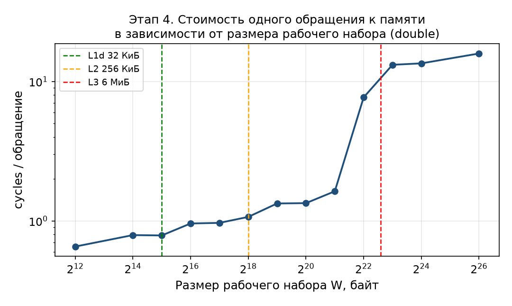
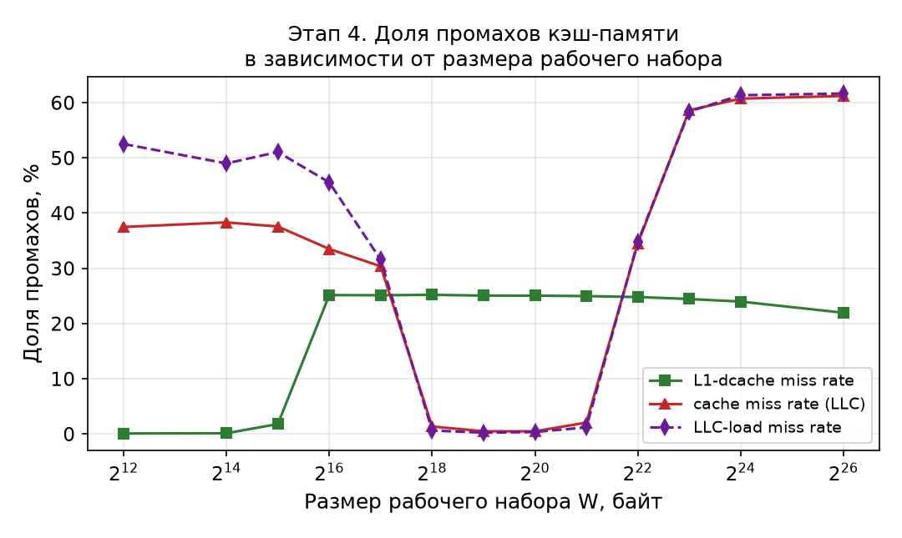
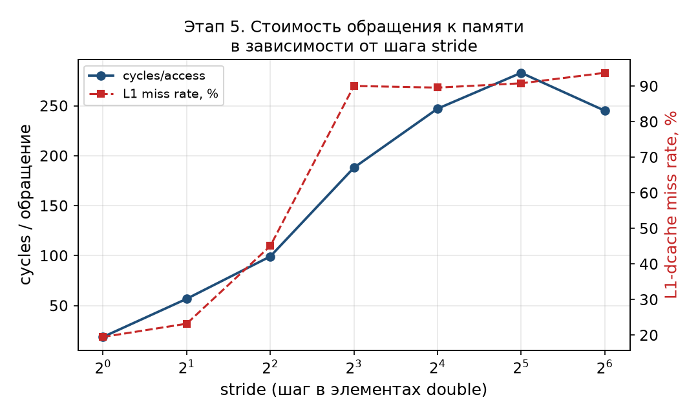
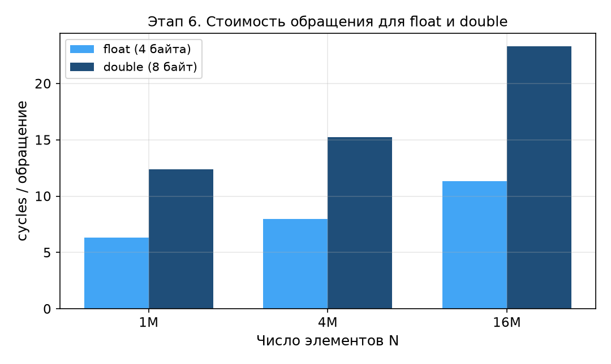
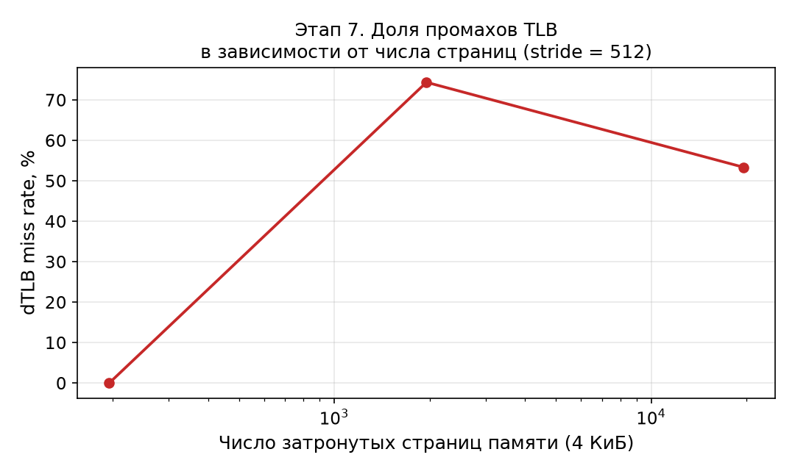
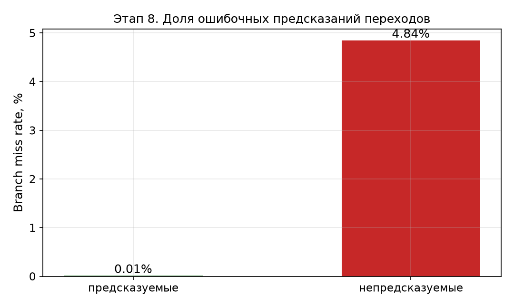

# Лабораторная работа 1 — исследование производительности CPU и подсистемы памяти

**Выполнил:** Баряев Андрей Алексеевич, группа Р4135<br>
**Проверил:** Лукашов И. В.<br>
**Университет:** Национальный исследовательский университет ИТМО<br>
**Год:** 2026

[Открыть оформленный PDF](report.pdf) · [Исходный код и сохранённые результаты](code/)

**Материалы:** [DAXPY](code/daxpy.cpp) · [сценарий экспериментов](code/run_experiments.py) · [исходные результаты](code/results/results.json)

## 1. Цель и задачи работы

Цель работы — изучить методы экспериментального исследования производительности центрального процессора и получить практические навыки анализа влияния подсистемы памяти и особенностей микроархитектуры CPU на выполнение программ.

Для достижения цели решаются следующие задачи:

- определить характеристики вычислительной системы и подготовить средства аппаратного профилирования perf;

- собрать тестовое приложение, выполнить базовое профилирование и рассчитать IPC;

- оценить повторяемость измерений;

- исследовать влияние размера рабочего набора на работу кэш-памяти;

- исследовать влияние шага доступа stride и пространственной локальности;

- сравнить поведение типов данных float и double;

- исследовать работу TLB;

- исследовать предсказатель переходов;

- обобщить результаты и связать их с характеристиками микроархитектуры.

В качестве тестовой нагрузки используется цикл DAXPY вида y[i] = a·x[i] + y[i]. Исходный код программы доступен в каталоге code (файл daxpy.cpp). Число элементов N, число повторов repeats и шаг stride задаются параметрами командной строки. Рабочий набор при stride = 1 составляет W = 2·N·sizeof(T) байт, поскольку обрабатываются два массива x и y.

## 2. Этап 1. Характеристики системы и подготовка perf

Исследования выполнялись на физическом компьютере под управлением Linux (без виртуализации), что обеспечивает корректный доступ к аппаратным счётчикам PMU.

Основные характеристики системы:

**Таблица 1 — Характеристики вычислительной системы**

| Параметр | Значение |
| --- | --- |
| Модель CPU | Intel(R) Core(TM) i7-4710HQ CPU @ 2.50 ГГц (Haswell) |
| Ядра / аппаратные потоки | 4 физических ядра / 8 логических потоков (2 на ядро) |
| L1d-кэш | 128 КиБ (4 × 32 КиБ, по 32 КиБ на ядро) |
| L1i-кэш | 128 КиБ (4 × 32 КиБ) |
| L2-кэш | 1 МиБ (4 × 256 КиБ, по 256 КиБ на ядро) |
| L3/LLC | 6 МиБ (общий) |
| Объём оперативной памяти | 12.4 ГБ (11.6 ГиБ) |
| Размер страницы | 4096 байт |
| Операционная система | Linux fedora 6.17.1-300.fc43.x86_64 |
| Компилятор | g++ (GCC) 15.3.1 |
| Версия perf | 7.2.8-100.fc43.x86_64 |
| perf_event_paranoid | 1 (доступ к аппаратным счётчикам разрешён) |

Для доступа к аппаратным счётчикам параметр kernel.perf_event_paranoid был установлен в значение 1. NMI watchdog отключён, чтобы освободить аппаратный счётчик и снизить вероятность мультиплексирования. Доля времени работы каждого события отдельно не сохранена, поэтому полное отсутствие мультиплексирования не подтверждено. Проверка perf stat echo test выполняется успешно.

Среди доступных аппаратных событий, использованных в работе: cycles, instructions, cache-references, cache-misses, L1-dcache-loads, L1-dcache-load-misses, LLC-loads, LLC-load-misses, dTLB-loads, dTLB-load-misses, branches, branch-misses. События stalled-cycles-frontend и stalled-cycles-backend на данном процессоре не поддерживаются (что отмечено далее в дополнительном разделе).

## 3. Этап 2. Базовое профилирование

Программа собрана командой:

```text
g++ daxpy.cpp -O3 -std=c++17 -o daxpy
```

Выполнен пробный запуск ./daxpy 1000000 100 1 (N = 1 000 000, repeats = 100, stride = 1, тип double). Результаты профилирования представлены в таблице 2.

**Таблица 2 — Базовые показатели производительности**

| Показатель | Значение |
| --- | --- |
| Время (task-clock) | 457,53 мс |
| cycles | 1 498 536 515 |
| instructions | 287 076 415 |
| IPC = instructions / cycles | 0,19 |
| cache-references | 10 658 340 |
| cache-misses | 6 508 829 |

Дополнительно измерены события L1 и LLC (таблица 3).

**Таблица 3 — События кэш-памяти на этапе 2**

| Событие | Значение |
| --- | --- |
| L1-dcache-loads | 59 565 763 |
| L1-dcache-load-misses | 13 752 429 |
| L1 miss rate | 23,09 % |
| LLC-loads | 10 219 554 |
| LLC-load-misses | 6 337 650 |
| LLC miss rate | 62,01 % |

Полученное значение IPC ≈ 0,19. Величина IPC меньше единицы, что типично для программы, ограниченной подсистемой памяти: значительная часть тактов уходит на обработку промахов кэша, а не на выполнение инструкций. Рабочий набор (два массива по 8 МБ) существенно превышает объём L3, поэтому обращения идут в оперативную память.

## 4. Этап 3. Исследование повторяемости измерений

Стабильность измерений оценена двумя способами: многократным запуском perf stat -r 10 и серией из десяти отдельных запусков.

**Таблица 4 — Повторяемость при perf stat -r 10**

| Показатель | Среднее | Разброс (perf), % |
| --- | --- | --- |
| Время, мс | 453,56 | 0,46 |
| cycles | 1 463 622 773 | 0,89 |
| instructions | 287 175 297 | 0,08 |
| cache-references | 10 581 015 | 0,22 |
| cache-misses | 6 443 724 | 0,39 |

При закреплении процесса за логическим CPU 2 (taskset -c 2) результаты практически не изменились:

**Таблица 5 — Повторяемость при perf stat -r 10 с taskset -c 2**

| Показатель | Среднее | Разброс (perf), % |
| --- | --- | --- |
| Время, мс | 444,89 | 0,22 |
| cycles | 1 451 079 000 | 0,28 |

Отдельные запуски того же эксперимента дают заметно больший разброс (таблица 6), что связано с изменением частоты мобильного процессора (масштабирование частоты, Turbo Boost), нагревом и фоновыми процессами.

**Таблица 6 — Десять отдельных запусков**

| № | task-clock, мс | cycles |
| --- | --- | --- |
| 1 | 460,29 | 1 489 113 905 |
| 2 | 444,90 | 1 430 616 556 |
| 3 | 449,17 | 1 291 543 147 |
| 4 | 449,44 | 1 317 789 554 |
| 5 | 463,81 | 1 492 668 681 |
| 6 | 449,39 | 1 469 172 637 |
| 7 | 458,83 | 1 498 918 837 |
| 8 | 451,04 | 1 472 360 185 |
| 9 | 455,20 | 1 484 611 557 |
| 10 | 452,19 | 1 482 826 332 |

Среднее время: 453,43 мс, стандартное отклонение 5,63 мс (коэффициент вариации ≈ 1,24 %). Средние cycles: 1 442 962 139, отклонение 71 662 572 (коэффициент вариации ≈ 4,97 %).

Вывод: при perf stat -r 10 относительный разброс времени составляет 0,46 %, а десять отдельных запусков дали 444,90–463,81 мс (максимум выше минимума на 4,25 %). Изменения частоты CPU, температуры и фоновой нагрузки могли повлиять на результат, но отдельно не измерялись. Для сравнения режимов использованы усреднённые и нормализованные показатели.

## 5. Этап 4. Размер рабочего набора и кэш-память

Исследовалось влияние размера рабочего набора W = 2·N·8 байт на производительность. Число повторов подбиралось так, чтобы N·repeats оставалось приблизительно постоянным (≈ 2·10⁸). Использовались stride = 1 и тип double. В таблице 7 cycles/access означает число тактов на одну итерацию DAXPY, а не аппаратную задержку одного чтения: итерация обращается к обоим массивам. Для каждого режима выполнялись три группы событий (базовые, L1, LLC).

**Таблица 7 — Зависимость показателей от размера рабочего набора**

| N | W, КиБ | repeats | cycles, 10⁶ | cycles/ обращ. | cache miss, % | L1 miss, % | LLC miss, % |
| --- | --- | --- | --- | --- | --- | --- | --- |
| 256 | 4 | 781250 | 130,9 | 0,65 | 37,48 | 0,08 | 52,51 |
| 1024 | 16 | 195312 | 158,3 | 0,79 | 38,31 | 0,12 | 48,99 |
| 2048 | 32 | 97656 | 157,3 | 0,79 | 37,57 | 1,79 | 51,06 |
| 4096 | 64 | 48828 | 191,7 | 0,96 | 33,49 | 25,14 | 45,54 |
| 8192 | 128 | 24414 | 193,6 | 0,97 | 30,36 | 25,12 | 31,56 |
| 16384 | 256 | 12207 | 213,7 | 1,07 | 1,35 | 25,19 | 0,62 |
| 32768 | 512 | 6104 | 266,9 | 1,33 | 0,48 | 25,05 | 0,23 |
| 65536 | 1024 | 3052 | 268,3 | 1,34 | 0,47 | 25,04 | 0,35 |
| 131072 | 2048 | 1526 | 326,4 | 1,63 | 2,06 | 24,96 | 1,19 |
| 262144 | 4096 | 763 | 1 540,0 | 7,70 | 34,49 | 24,80 | 34,75 |
| 524288 | 8192 | 381 | 2 634,5 | 13,19 | 58,61 | 24,44 | 58,39 |
| 1048576 | 16384 | 191 | 2 704,1 | 13,50 | 60,73 | 23,97 | 61,34 |
| 4194304 | 65536 | 48 | 3 199,4 | 15,89 | 61,21 | 21,95 | 61,65 |

График зависимости стоимости одного обращения от размера рабочего набора приведён на рисунке 1, а зависимость доли промахов кэш-памяти — на рисунке 2.



*Рисунок 1 — Стоимость одного обращения к памяти в зависимости от размера рабочего набора (double)*



*Рисунок 2 — Доля промахов кэш-памяти в зависимости от размера рабочего набора*

На графике отчётливо видны три области:

- W ≤ 32 КиБ (N ≤ 2048): рабочий набор помещается в L1d (32 КиБ на ядро). Нормированная стоимость составляет 0,65–0,79 такта на итерацию; доля промахов L1 не превышает 1,79 %.

- При W от 64 до 256 КиБ нормированная стоимость составляет 0,96–1,07 такта на итерацию, а доля промахов L1 — около 25 %. Это согласуется с переходом от L1 к L2 (256 КиБ на ядро).

- При W от 512 КиБ до 2 МиБ стоимость составляет 1,33–1,63 такта на итерацию. При 4 МиБ она уже достигает 7,70, а при 8–64 МиБ — 13,19–15,89. Для 64 МиБ доля LLC-load-misses равна 61,65 %, а не почти 100 %.

Резкий рост наблюдается между 2 и 8 МиБ, причём начинается уже при 4 МиБ — до номинальной ёмкости L3 в 6 МиБ. Эксперимент показывает изменение поведения памяти в этой области, но имеющихся точек недостаточно, чтобы определить точную границу эффективного кэширования. Показатели generic cache-misses/cache-references и LLC-load-misses/LLC-loads получены от разных событий и не тождественны.

## 6. Этап 5. Шаг доступа (stride) и пространственная локальность

Исследовалось влияние шага обращения к памяти. Массив имеет размер N = 10 000 000 элементов double (80 МБ, что существенно превышает L3). Число повторов масштабировалось пропорционально stride (repeats = 20·stride), чтобы число фактических обращений N_access = (N/stride)·repeats оставалось постоянным и равным 2·10⁸. Это исключает влияние инициализации массивов и позволяет корректно сравнивать нормализованную стоимость cycles/access.

**Таблица 8 — Зависимость показателей от шага stride**

| stride | repeats | N_access | cycles, 10⁹ | cycles/ обращ. | L1 miss, % | cache miss, % |
| --- | --- | --- | --- | --- | --- | --- |
| 1 | 20 | 200000000 | 3,72 | 18,59 | 19,49 | 61,65 |
| 2 | 40 | 200000000 | 11,35 | 56,75 | 23,21 | 59,63 |
| 4 | 80 | 200000000 | 19,83 | 99,16 | 45,05 | 56,05 |
| 8 | 160 | 200000000 | 37,60 | 188,00 | 90,03 | 61,36 |
| 16 | 320 | 200000000 | 49,41 | 247,07 | 89,57 | 90,98 |
| 32 | 640 | 200000000 | 56,59 | 282,96 | 90,78 | 97,12 |
| 64 | 1280 | 200000000 | 49,01 | 245,05 | 93,72 | 98,72 |



*Рисунок 3 — Стоимость обращения к памяти и доля промахов L1 в зависимости от stride*

При stride = 1 последовательные элементы используют соседние позиции 64-байтной строки кэша (в строке восемь элементов double). Это повышает долю полезных данных, извлекаемых при загрузке строки. Значение cycles/access далее нормировано на одну итерацию цикла.

При увеличении stride пространственная локальность ухудшается: при stride = 2 выбирается половина элементов строки, при stride ≥ 8 — не более одного из восьми. Измеренная стоимость выросла с 18,59 такта на итерацию при stride = 1 до 245,05 при stride = 64 (в 13,18 раза). Это согласуется с ростом затрат на обработку одного полезного элемента; объём фактического трафика отдельно не измерялся.

Наиболее заметный рост наблюдается при переходе от stride = 1 к 8. Такое поведение согласуется с размером строки кэша 64 байта, но само по себе не является независимым измерением её размера.

## 7. Этап 6. Влияние типа данных

Сравнивалось выполнение одного и того же алгоритма для float (4 байта) и double (8 байт) при одинаковых N и repeats. Для каждого типа рабочий набор W = 2·N·sizeof(T) различается вдвое. Результаты приведены в таблице 9.

**Таблица 9 — Сравнение float и double**

| тип | N | W, МБ | repeats | cycles, 10⁹ | cycles/ обращ. | cache miss, % |
| --- | --- | --- | --- | --- | --- | --- |
| float | 1000000 | 8,0 | 200 | 1,26 | 6,30 | 55,74 |
| double | 1000000 | 16,0 | 200 | 2,48 | 12,38 | 58,12 |
| float | 4000000 | 32,0 | 50 | 1,59 | 7,96 | 60,34 |
| double | 4000000 | 64,0 | 50 | 3,05 | 15,25 | 59,03 |
| float | 16000000 | 128,0 | 12 | 2,17 | 11,31 | 59,44 |
| double | 16000000 | 256,0 | 12 | 4,47 | 23,28 | 59,85 |



*Рисунок 4 — Стоимость обращения для float и double*

При одинаковом N тип float уменьшает объём двух массивов вдвое. По task-clock время double/float составляет 806,83/389,69 ≈ 2,07 при N = 1 000 000 и 1401,82/708,01 ≈ 1,98 при N = 16 000 000. Отношения cycles для тех же режимов равны соответственно 1,96 и 2,06. Оба рабочих набора при этих N больше L3; более короткое время float согласуется с меньшим объёмом обрабатываемых данных, но вклад отдельных причин отдельно не измерялся.

Уменьшение размера элемента снижает объём данных. Представленные измерения показывают уменьшение времени и числа тактов для float при одинаковых N и repeats.

## 8. Этап 7. Исследование TLB

Страница памяти имеет размер 4096 байт; в ней помещается 512 элементов double. Поэтому stride = 512 соответствует шагу 4096 байт в каждом массиве. В таблице 10 число страниц рассчитано для одного массива; DAXPY обращается к двум массивам, так что совокупное число затронутых страниц приблизительно вдвое больше. Число итераций при stride = 512 поддерживалось около 5·10⁷, а длина массивов менялась.

**Таблица 10 — Показатели TLB при stride = 512 (число страниц одного массива)**

| N | Страниц на массив | repeats | dTLB-loads, 10⁶ | dTLB-load- misses, 10⁶ | dTLB miss, % | cycles/ обращ. |
| --- | --- | --- | --- | --- | --- | --- |
| 100000 | 195 | 256000 | 102,3 | 0,0 | 0,03 | 46,20 |
| 1000000 | 1953 | 25600 | 111,5 | 83,0 | 74,38 | 253,26 |
| 10000000 | 19531 | 2560 | 162,6 | 86,8 | 53,38 | 280,36 |
| 10000000 (stride 1) | 19531 | 20 | 178,5 | 0,6 | 0,32 | 17,98 |



*Рисунок 5 — Доля промахов dTLB в зависимости от числа страниц одного массива*

При N = 100 000 обработано около 195 страниц в каждом массиве, зарегистрированная доля dTLB-load-misses составляет 0,03 %, стоимость — 46,20 такта на итерацию. При N = 1 000 000 это 1953 страницы на массив, 74,38 % и 253,26 такта (в 5,48 раза больше). При N = 10 000 000 показатель составляет 53,38 % и 280,36 такта. Данные согласуются с ростом затрат на трансляцию адресов при большем рабочем наборе страниц, но не позволяют установить ёмкость конкретного уровня TLB.

При последовательном доступе с stride = 1 для N = 10 000 000 зарегистрировано 0,32 % dTLB-load-misses; при stride = 512 — 53,38 %. Шаг 512 элементов равен 4096 байт, то есть примерно одной странице каждого массива. Число итераций у двух режимов различается (200 млн и около 50 млн), поэтому корректно сравнивать доли и нормированные такты. Отдельная метрика обходов таблицы страниц не измерялась.

## 9. Этап 8. Исследование предсказателя переходов

Использовался тестовый цикл if (data[i]) sum += data[i]. В режиме predictable массив заполнен регулярно (сначала нули, затем единицы), в режиме random — псевдослучайной последовательностью. Чтобы компилятор не заменил условный переход на условную передачу (cmov) и не векторизовал цикл, программа branch_test собрана без оптимизации (-O0). Результаты приведены в таблице 11.

**Таблица 11 — Результаты теста предсказателя переходов**

| Режим | branches, 10⁹ | branch- misses, 10⁶ | miss rate, % | cycles, 10⁹ | instructions, 10⁹ | время, мс |
| --- | --- | --- | --- | --- | --- | --- |
| Предсказуемые | 1,03 | 0,1 | 0,01 | 4,33 | 8,01 | 1 411,68 |
| Непредсказуемые | 1,03 | 50,1 | 4,84 | 6,52 | 8,09 | 2 172,08 |



*Рисунок 6 — Доля ошибочных предсказаний переходов*

Доля ошибок предсказания составляет около 0,01 % в регулярном режиме и 4,84 % в случайном; число зарегистрированных branch-misses отличается примерно в 475 раз. Время выросло с 1411,68 до 2172,08 мс (в 1,54 раза), а cycles — с 4,33 до 6,52 млрд (в 1,51 раза). Число инструкций отличается менее чем на 1 %.

При ошибке предсказания конвейер вынужден сбросить уже выбранные, но оказавшиеся ненужными инструкции и заново заполнить конвейер. Чем больше доля таких ошибок, тем ниже полезная загрузка конвейера и тем больше тактов расходуется на ту же работу. Это подтверждает высокую стоимость ошибок предсказателя переходов.

## 10. Этап 9. Итоговый анализ

Полученные результаты согласуются с характеристиками процессора Intel Core i7-4710HQ (Haswell) и объясняются особенностями микроархитектуры.

- Иерархия кэш-памяти. При увеличении рабочего набора меняются cycles на итерацию и доли промахов L1/LLC. Основной рост стоимости зарегистрирован между 2 и 8 МиБ, в том числе при 4 МиБ — до номинальных 6 МиБ L3. Поэтому точную границу L3 по этим точкам определить нельзя.

- Пространственная локальность. Увеличение stride снижает долю полезных элементов в строке кэша и сопровождается ростом нормированной стоимости в 13,18 раза. Фактический объём трафика не измерялся.

- Размер элементов данных. При тех же N и repeats float занимает вдвое меньше памяти, а измеренное время ниже. Это согласуется с меньшим объёмом передаваемых данных.

- TLB. При большем наборе страниц доля зарегистрированных dTLB-load-misses возрастает; одновременно растут cycles на итерацию. Число обходов таблицы страниц отдельно не измерялось.

- Предсказатель переходов. В случайном режиме зарегистрировано примерно в 475 раз больше branch-misses; измеренное время выше в 1,54 раза при близком числе инструкций.

Общий вывод: производительность программы определяется не только числом операций в исходном коде, но и тем, насколько эффективно используется иерархия памяти и предсказатель переходов. Изменяя размер рабочего набора, шаг доступа и тип данных, можно целенаправленно управлять этими эффектами.

## 11. Дополнительное задание. Программный доступ к счётчикам

Дополнительно аппаратные счётчики считывались непосредственно из C++-программы через системный вызов perf_event_open(). Программа собрана командой:

```text
g++ function_profiling_example.cpp perf_count.cpp -O3 -std=c++17 -o profiled_daxpy
```

Событие создаётся системным вызовом SYS_perf_event_open; тип события задаётся полем type структуры perf_event_attr (PERF_TYPE_HARDWARE — для cycles, instructions, cache-references, cache-misses, branches, branch-misses; PERF_TYPE_HW_CACHE — для событий L1D и dTLB), а конкретное событие — полем config. Сбор запускается и останавливается через ioctl с командами PERF_EVENT_IOC_ENABLE и PERF_EVENT_IOC_DISABLE, значения читаются из файлового дескриптора события функцией read().

**Таблица 12 — Программное профилирование (N = 1 000 000, repeats = 10)**

| Режим | Показатели |
| --- | --- |
| Инструкции | cycles = 250 500 228, instructions = 70 008 820, IPC = 0,28 |
| Кэш L1 | cache-references = 932 176, cache-misses = 844 112, L1-loads = 14 403 879, L1-misses = 1 221 661 |
| TLB | dTLB-loads = 15 187 728, dTLB-load-misses = 19 186 |
| Переходы | branches = 10 000 277, branch-misses = 70 |

Программный профилировщик для N = 1 000 000 и repeats = 10 измерял только вычислительный цикл: IPC = 70 008 820 / 250 500 228 ≈ 0,28. Базовый запуск perf stat этапа 2 использовал repeats = 100 и учитывал весь процесс, поэтому его абсолютные значения напрямую несопоставимы с таблицей 12. Оба способа используют подсистему perf_event, но измеряемые интервалы различаются.

Важно отметить, что события stalled-cycles-frontend и stalled-cycles-backend на данном процессоре не поддерживаются; программа была доработана так, чтобы пропускать неподдерживаемые события и продолжать измерение остальных. Оба способа (perf stat и perf_event_open) используют одну и ту же подсистему Linux perf_event и аппаратные счётчики PMU; различие лишь в том, что во втором случае управление событиями выполняется непосредственно из пользовательского приложения.

## Заключение

В ходе лабораторной работы выполнены все девять обязательных этапов и дополнительное задание. Определены характеристики системы (Intel Core i7-4710HQ: L1d 32 КиБ/ядро, L2 256 КиБ/ядро, L3 6 МиБ, страница 4 КиБ), освоена работа с утилитой perf и программным интерфейсом perf_event_open.

В работе обнаружены изменения производительности при изменении рабочего набора, stride, типа данных и характера переходов. Стоимость в серии по рабочему набору возросла с 1,63 такта на итерацию при 2 МиБ до 13,19 при 8 МиБ; предел L3 по этим точкам точно не определяется. Для stride = 64 стоимость на итерацию выше, чем для stride = 1, в 13,18 раза. В случайном тесте переходов число branch-misses выше примерно в 475 раз, а время — в 1,54 раза. Среднее время десяти отдельных базовых запусков составило 453,43 мс с генеральным СКО 5,63 мс.

## Ответы на контрольные вопросы

### 1. Что такое IPC и как он рассчитывается?

IPC (Instructions Per Cycle) — число выполненных инструкций за один такт процессора. Рассчитывается как отношение количества выполненных инструкций к количеству тактов: IPC = instructions / cycles.

### 2. Зачем процессору несколько уровней кэш-памяти?

Быстрая память мала, а большая память медленна. Несколько уровней позволяют совместить скорость и объём: L1 максимально быстрый, но маленький, L2 больше и медленнее, L3 ещё больше. Так большинство обращений обслуживается из быстрых уровней, а дорогая оперативная память используется редко.

### 3. Что такое cache hit и cache miss?

Cache hit — нужные данные найдены в кэше, доступ быстрый. Cache miss — данных в кэше нет, требуется обратиться к следующему уровню памяти, что существенно медленнее.

### 4. Что такое строка кэша?

Минимальная порция данных, которой обмениваются кэш и память (обычно 64 байта). В одну строку помещается несколько соседних элементов массива.

### 5. Что понимается под пространственной локальностью?

Свойство программы обращаться к близко расположенным адресам памяти. При последовательном обходе массива одна загруженная строка кэша содержит сразу несколько нужных элементов, что повышает эффективность.

### 6. Почему увеличение stride может снижать производительность?

При большом stride из каждой загруженной строки кэша используется лишь часть, а иногда один элемент. Эффективный трафик памяти на одно полезное обращение растёт, растёт число промахов кэша и TLB, и стоимость обращения увеличивается.

### 7. Что называется рабочим набором программы?

Объём данных, активно используемых программой в некоторый момент времени. Если рабочий набор помещается в кэш, большинство обращений обслуживается из него.

### 8. Почему производительность может резко измениться при увеличении рабочего набора?

Когда рабочий набор перестаёт помещаться в очередной уровень кэша, данные начинают вытесняться и обслуживаться из более медленного уровня или из оперативной памяти. Это вызывает резкий рост доли промахов и стоимости обращения.

### 9. Что такое TLB?

Translation Lookaside Buffer — кэш соответствий виртуальных и физических адресов страниц памяти, ускоряющий трансляцию адресов.

### 10. Что происходит при TLB miss?

При промахе первого уровня TLB соответствие может быть найдено на следующем уровне. Если и там его нет, выполняется обход таблицы страниц. Такая трансляция может добавить задержку к обращению к памяти.

### 11. Для чего используется предсказатель переходов?

Чтобы заранее определить направление условного перехода и продолжить загрузку конвейера без ожидания вычисления условия, повышая загрузку конвейера.

### 12. Почему случайное условие может выполняться медленнее предсказуемого?

При случайном условии предсказатель часто ошибается, конвейер сбрасывается и заполняется заново, что расходует такты впустую. При предсказуемом условии ошибок почти нет.

### 13. Зачем производить несколько повторов одного измерения?

Чтобы уменьшить влияние случайных факторов (частота CPU, фоновые процессы, нагрев) и получить более устойчивое среднее значение и оценку разброса.

### 14. Почему нельзя напрямую сравнивать абсолютное время экспериментов с разным количеством обработанных элементов?

Время пропорционально объёму работы. При разном N или repeats выполняется разное число операций, поэтому сравнивать нужно нормализованные метрики, например cycles на одно обращение.

### 15. Какие ограничения имеет использование perf в виртуальной машине или WSL2?

Часть аппаратных PMU-событий недоступна или эмулируется, значения могут искажаться, а результаты нельзя напрямую сравнивать с native Linux. Доступ к счётчикам может ограничиваться настройкой perf_event_paranoid.

## Список использованных источников

### 1. Паттерсон Д., Хеннесси Дж. Компьютерная архитектура: количественный подход. — М.: ДМК Пресс, 2016.

### 2. Лукашов И. В. Лекция 1. Архитектура процессоров (AVSII). — ИТМО, 2026.

### 3. Методические указания к лабораторной работе № 1 «Исследование производительности CPU и подсистемы памяти». — ИТМО, 2026.

### 4. Linux perf_event_open(2) — manual pages. — URL: https://man7.org/linux/man-pages/man2/perf_event_open.2.html

### 5. Intel 64 and IA-32 Architectures Optimization Reference Manual. — Intel Corporation, 2023.
