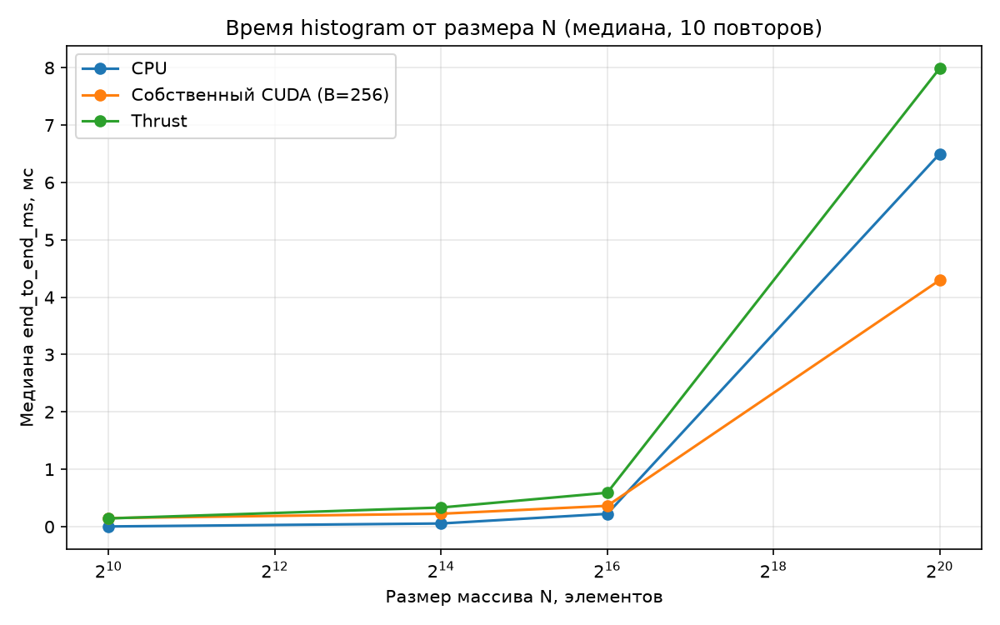
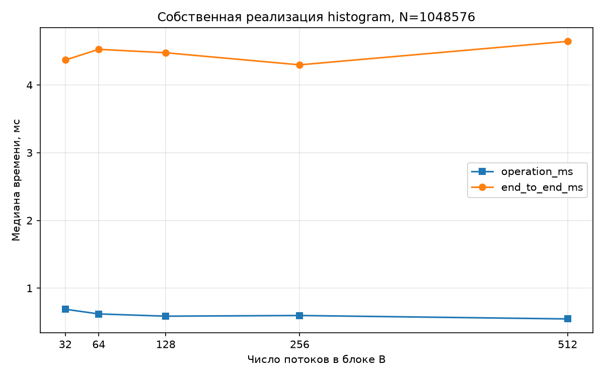
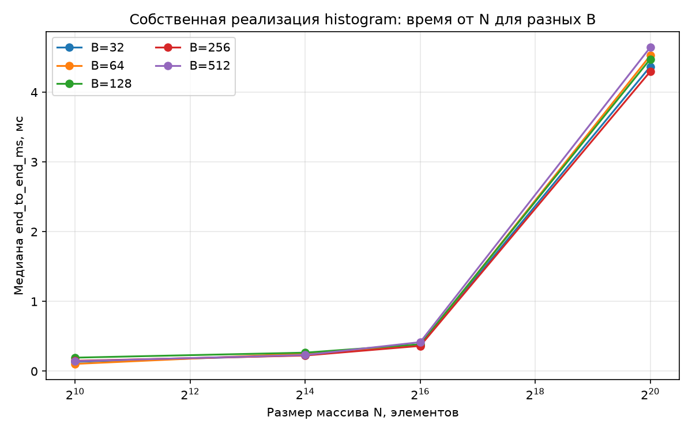

# Лабораторная работа 2 - базовые параллельные примитивы на GPU

**Выполнил:** Баряев Андрей Алексеевич, группа Р4135<br>
**Проверил:** Лукашов И. В.<br>
**Дисциплина:** Вычисления на GPU<br>
**Университет:** Национальный исследовательский университет ИТМО<br>
**Год:** 2026

[Открыть оформленный PDF](report.pdf) · [Исходный код и сохранённые результаты](code/)

**Материалы:** [CUDA-реализация](code/nvidia/student/histogram.cuh) · [CSV серии](code/results/series.csv) · [протокол тестов](code/results/tests.xml) · [параметры машины](code/results/environment.txt)

**Вариант:** 6 - Histogram (`histogram.cuh`)

## Введение

Цель работы - изучить преобразование последовательного алгоритма в параллельную форму и получить навыки реализации, проверки и исследования производительности программы на GPU.

Задачи работы: определить характеристики системы и compute capability GPU; собрать проект и проверить эталонные реализации; изучить CPU-алгоритм своего варианта и спроектировать его параллельную реализацию; реализовать алгоритм средствами CUDA; проверить корректность на обычных и граничных данных; получить базовые измерения CPU-, собственной GPU- и библиотечной GPU-реализаций; исследовать повторяемость измерений, влияние размера данных и числа потоков в блоке; объяснить результаты.

Назначенный вариант - вариант 6, алгоритм Histogram (построение гистограммы), файл nvidia/student/histogram.cuh. Гистограмма - это массив из bins целочисленных счётчиков; для каждого входного значения x номер счётчика равен bin = |int(10·x)| mod bins. Сумма всех счётчиков должна быть равна числу входных элементов N.

Работа выполнена локально на ноутбуке с дискретной NVIDIA GPU. Все измерения проведены на одной машине в одной сессии; исходные CSV, сводки и протокол проверок сохранены в каталоге results рабочей копии.

## 1. Характеристики системы и подготовка проекта (этап 1)

Рабочая копия получена распаковкой выданного архива. Характеристики системы сохранены в файле results/environment.txt. Основные сведения приведены в таблице 1.

**Таблица 1 - Характеристики программно-аппаратной среды**

| Параметр | Значение |
| --- | --- |
| Операционная система | Fedora Linux 43 (Workstation), ядро 7.2.8-100.fc43 |
| CPU | Intel Core i7-4710HQ, 2,50 ГГц, 4 ядра / 8 потоков |
| ОЗУ | 12 ГБ (DDR3: 4 ГБ + 8 ГБ) |
| GPU | NVIDIA GeForce GTX 860M (GM107M), 2 ГБ |
| Compute capability | 5.0 (CMAKE_CUDA_ARCHITECTURES=50) |
| Драйвер NVIDIA | 580.178.04 |
| CUDA Toolkit | 12.9 (nvcc V12.9.86) |
| Host-компилятор для nvcc | GNU g++ 14.4.1 |
| Компилятор C++ | GNU g++ 15.3.1 |
| CMake / GoogleTest | 3.31.11 / 1.15.2 |
| Compute Sanitizer | 12.9 |

Compute capability определена программой tools/device_info.cu: в её выводе получено значение CMAKE_CUDA_ARCHITECTURES=50. Это значение использовано при сборке.

Для запуска вычислений на дискретной GPU потребовалось включить её в работу: по умолчанию устройство обслуживалось открытым драйвером nouveau. Установлен проприетарный драйвер NVIDIA ветки 580 (akmod-nvidia) и CUDA Toolkit 12.9. Дополнительно потребовалась небольшая правка заголовков CUDA 12.9: в glibc 2.42 (Fedora 43) функции cospi, sinpi, rsqrt и их float-варианты объявлены с noexcept, что конфликтует с объявлениями в crt/math_functions.h. В двух заголовках CUDA соответствующим объявлениям добавлен спецификатор noexcept; резервные копии сохранены рядом с исходными файлами. На реализацию алгоритма эта правка не влияет. Перед измерениями включён режим постоянства драйвера и зафиксированы прикладные частоты GPU (nvidia-smi -pm 1 -ac 2505,1019), чтобы уменьшить разброс.

## 2. Сборка проекта и проверка эталонов (этап 2)

Проект собран только для назначенного алгоритма histogram. Команда конфигурации и сборки:

```text
ARCH=50
ALG=histogram
cmake -S nvidia -B build \
-DLAB_ALGORITHM="$ALG" \
-DCMAKE_CUDA_ARCHITECTURES="$ARCH" \
-DCMAKE_BUILD_TYPE=Release \
-DCMAKE_CUDA_COMPILER=/usr/local/cuda/bin/nvcc \
-DCMAKE_CUDA_HOST_COMPILER=/usr/bin/g++-14 \
-DCUDAToolkit_ROOT=/usr/local/cuda \
-DCMAKE_CUDA_FLAGS="-Wno-deprecated-gpu-targets"
cmake --build build -j4
```

Сборка прошла без ошибок; получены программы build/gtest/test_histogram, build/benchmark/bench_histogram и build/tools/device_info. До реализации собственного алгоритма выполнены проверки групп CPU и Reference:

```text
./build/gtest/test_histogram --gtest_filter='CPU.*:Reference.*'
[  PASSED  ] 3 tests.
```

Проверки группы CPU содержат малые примеры с известными ответами, Проверки группы Reference сравнивают библиотечную реализацию Thrust с CPU-эталоном. Обе группы пройдены, что подтверждает корректность окружения.

## 3. Изучение и проектирование алгоритма (этап 3)

CPU-эталон (nvidia/include/cpu_reference.hpp) обнуляет массив счётчиков и последовательно увеличивает нужный счётчик для каждого элемента. Номер счётчика вычисляется по формуле:

bin(x) = |int(10·x)| mod bins	(1)

где int(·) - приведение к типу int с усечением дробной части в сторону нуля, а модуль берётся после приведения к int. Такой порядок важен для отрицательных x. Число счётчиков bins задаётся отдельно от длины массива; по умолчанию bins = 256.

Малый пример из набора проверок: x = {0; 0,2; 0,1; 0,2}, bins = 4. Значения номеров счётчиков: 0, 2, 1, 2. Итоговая гистограмма: {1; 1; 2; 0}. Сумма счётчиков равна N = 4, что проверяется тестом.

Схема распараллеливания. Базовый вариант - прямое накопление в глобальной памяти: каждый поток независимо вычисляет номер счётчика своего элемента и выполняет atomicAdd в глобальный массив. Число глобальных атомарных операций равно N, что при малом числе счётчиков приводит к сильной конкуренции за одни и те же ячейки.

Оптимизированный вариант использует приватную гистограмму блока в разделяемой памяти. Каждый блок: (1) кооперативно обнуляет свою копию гистограммы; (2) после барьера проходит входные элементы с шагом сетки и накапливает их в разделяемой памяти через atomicAdd; (3) после второго барьера добавляет накопленные счётчики в глобальную гистограмму. При этом глобальных атомарных операций становится порядка bins на блок вместо N. Разделяемая память доступна только внутри блока, поэтому барьер __syncthreads() здесь достаточен; межблочная синхронизация не используется - блоки завершают работу независимо, а слияние выполняется атомарными операциями.

Обработка границ. Цикл с шагом по сетке (grid-stride loop) обрабатывает неполный последний блок. При N = 0 ядро не запускается, а выходной массив обнуляется. Если гистограмма не помещается в разделяемую память (для GTX 860M указано 48 КиБ), код выбирает ядро с глобальными атомарными операциями. Этот резервный путь предусмотрен для больших bins, но представленными тестами не проверен: максимальное проверенное значение bins равно 257.

## 4. Реализация CUDA-функции (этап 4)

Реализация размещена только в файле nvidia/student/histogram.cuh. Определены вспомогательная функция histogram_bin, два __global__-ядра и функция-обёртка student::histogram. Сигнатура и контракт заготовки сохранены.

Ядро histogram_shared_kernel принимает входной указатель, выходной указатель, длину n и число счётчиков bins. Разделяемая память объявлена как extern __shared__ int block_hist[]; её размер равен bins·sizeof(int). Обнуление выполняется кооперативно с шагом blockDim.x, поэтому работает и при bins > blockDim.x. Накопление и слияние разделены барьерами __syncthreads(). Ядро histogram_global_kernel используется как базовый вариант при большом bins.

Функция student::histogram сначала обнуляет выходной массив с помощью cudaMemsetAsync в потоке 0 (инфраструктура не инициализирует выход), затем при N = 0 сразу возвращает управление. Для выбора варианта вычисляется размер разделяемой памяти и сравнивается с sharedMemPerBlock устройства. Если гистограмма помещается, размер сетки подбирается через cudaOccupancyMaxActiveBlocksPerMultiprocessor: запускается ровно столько блоков, сколько помещается на устройстве, но не больше, чем нужно для покрытия N. Иначе запускается базовое ядро с числом блоков, покрывающим массив. Все ядра запускаются в потоке 0; после запуска вызывается CUDA_CHECK(cudaGetLastError()). Временных буферов функция не выделяет, поэтому утечек нет; входной массив только читается.

Число потоков в блоке threads передаётся извне и реально используется при запуске ядер; исследуются значения 32, 64, 128, 256 и 512.

## 5. Проверка корректности (этап 5)

После реализации выполнены все проверки назначенного алгоритма. Полный протокол сохранён в results/tests.xml, результат запуска CTest - ниже:

```text
./build/gtest/test_histogram --gtest_output=xml:results/tests.xml
ctest --test-dir build --output-on-failure
1/3 cpu_reference ................. Passed
2/3 library_reference ............. Passed
3/3 student_correctness ........... Passed
100% tests passed, 0 tests failed out of 3
```

Проверки группы Student включают: малый пример; N = 0, 1, B-1, B, B+1 и N = 1003 для всех B из набора {32, 64, 128, 256, 512}; режим one-bin; разные значения bins (1, 16, 257); массив из 65 537 и 1 048 576 элементов. Дополнительно тесты повторяют вызов дважды на одних и тех же буферах, чтобы исключить зависимость от предыдущего результата, и проверяют, что входной массив не изменён.

В сохранённом протоколе пройдены 7 тестов в 3 наборах. Проверены пустой вход, некратные размеры, неполный последний блок, bins = 1, 16 и 257, отрицательные значения, повторный вызов и неизменность входа. Корректность пути при bins больше вместимости shared memory остаётся не подтверждённой данным набором тестов.

Дополнительно проведена проверка памяти программой Compute Sanitizer:

```text
compute-sanitizer --tool memcheck \
./build/gtest/test_histogram --gtest_filter='Student.KnownExample'
========= ERROR SUMMARY: 0 errors
```

Compute Sanitizer сообщил 0 ошибок при запуске только Student.KnownExample. Протокол этого малого примера сохранён в results/compute_sanitizer.txt; другие размеры этим запуском не проверялись.

## 6. Базовые измерения производительности (этап 6)

Программа bench_histogram измеряет три метрики. operation_ms - время вызова операции по часам CPU с ожиданием завершения GPU; device_ms - интервал CUDA Events вокруг операции; для CPU поле пустое. end_to_end_ms для GPU охватывает подготовку уже выделенных device-буферов, передачу входа, операцию и получение результата; для CPU оно совпадает с operation_ms. Выделение основных буферов, генерация данных, проверка и запись CSV находятся вне измеряемых интервалов. Реализации чередуются в одной сессии. Фоновая нагрузка и изменение частот всё равно могут влиять на разброс, поэтому выводы ниже опираются на повторы и медианы.

Первый запуск выполнен при N = 65 536, B = 256, warmup 3, repeat 10:

```text
./build/benchmark/bench_histogram \
--n 65536 --threads 256 --warmup 3 --repeat 10 \
--impl all --csv results/baseline.csv
```

**Таблица 2 - Базовые измерения (N = 65 536, B = 256, среднее по 10 повторам)**

| Реализация | operation_ms | device_ms | end_to_end_ms |
| --- | --- | --- | --- |
| CPU | 0,253035 | - | 0,253035 |
| Собственный CUDA | 0,258161 | 0,255382 | 0,414866 |
| Thrust | 0,373975 | 0,371363 | 0,554613 |

В базовом режиме end_to_end_ms включает передачу входа на устройство и получение результата, поэтому полное время GPU-реализаций больше времени CPU при данном N. Библиотечная реализация histogram составлена из набора Thrust-операций (вычисление номеров, сортировка, поиск верхних границ и разности), поэтому её трудоёмкость принципиально отличается от прямого подсчёта.

## 7. Повторяемость измерений (этап 7)

Для оценки разброса выполнено 30 измеряемых повторов при неизменных данных и настройках, после чего построена сводка:

```text
./build/benchmark/bench_histogram \
  --n 65536 --threads 256 --warmup 3 --repeat 30 \
  --seed 42 --impl all --csv results/repeats.csv
python3 scripts/summarize.py \
  --csv results/repeats.csv --out results/repeats_summary.csv
```

**Таблица 3 - Повторяемость (N = 65 536, B = 256, 30 повторов, медиана)**

| Реализация | Медиана operation_ms | Медиана end_to_end_ms | СКО end_to_end_ms | Мин / макс end_to_end_ms |
| --- | --- | --- | --- | --- |
| CPU | 0,227041 | 0,227041 | 0,048147 | 0,21078 / 0,39129 |
| Собственный CUDA | 0,150977 | 0,378837 | 0,132958 | 0,23742 / 0,91958 |
| Thrust | 0,366505 | 0,584064 | 0,143200 | 0,42308 / 1,17637 |

Разброс времени объясняется накладными расходами запуска ядер, передачей данных и влиянием других процессов, частот и нагрева GPU. Медиана устойчивее среднего, поэтому для сравнения реализаций далее используются медианы. Все сравниваемые реализации запускались на одной машине в одной сессии, что делает сравнение корректным.

## 8. Серии по размеру данных и блоку (этап 8)

Полная серия измерений получена для N из набора {1 024; 16 384; 65 536; 1 048 576} и B из набора {32; 64; 128; 256; 512}, по 10 повторов:

```text
python3 scripts/run_series.py \
  --exe build/benchmark/bench_histogram \
  --sizes 1024 16384 65536 1048576 \
  --blocks 32 64 128 256 512 --repeat 10 --out results/series.csv
python3 scripts/summarize.py \
  --csv results/series.csv --out results/series_summary.csv
```

На рисунке 1 показана медиана end_to_end_ms от размера N для трёх реализаций (для собственной реализации выбран B = 256).



*Рисунок 1 - Медиана end_to_end_ms от размера N*

При малом N собственная GPU-реализация проигрывает CPU по end_to_end_ms из-за затрат на запуск операции и подготовку данных. При N = 1 048 576 её медиана end_to_end_ms ниже медианы CPU и Thrust. Однако доля времени вне operation_ms при росте N не уменьшается: для B = 256 она составляет около 20 % при N = 1024 и около 86 % при N = 1 048 576. Эта разница включает передачу данных и подготовку буферов.

**Таблица 4 - Собственная реализация: медианы operation_ms / end_to_end_ms, мс**

| N \ B | 32 | 64 | 128 | 256 | 512 |
| --- | --- | --- | --- | --- | --- |
| 1 024 | 0,110 / 0,135 | 0,088 / 0,105 | 0,162 / 0,195 | 0,120 / 0,150 | 0,118 / 0,144 |
| 16 384 | 0,125 / 0,231 | 0,161 / 0,256 | 0,159 / 0,266 | 0,128 / 0,225 | 0,142 / 0,233 |
| 65 536 | 0,151 / 0,371 | 0,172 / 0,373 | 0,211 / 0,386 | 0,160 / 0,363 | 0,165 / 0,417 |
| 1 048 576 | 0,689 / 4,368 | 0,620 / 4,526 | 0,586 / 4,476 | 0,596 / 4,297 | 0,546 / 4,644 |

На рисунке 2 отдельно показано влияние размера блока B при N = 1 048 576.



*Рисунок 2 - Собственная реализация: медианы времени от B при большом N*

На рисунке 3 приведены кривые времени собственной реализации от N для каждого B.



*Рисунок 3 - Собственная реализация: end_to_end_ms от N для разных B*

При N = 1 048 576 наименьшая измеренная медиана end_to_end_ms получена для B = 256: 4,297 мс. Разница с B = 32 составляет лишь 0,071 мс, тогда как выборочное СКО при B = 256 около 0,776 мс (для остальных B - 0,529-0,655 мс). Поэтому устойчивый оптимум по этим измерениям не установлен. Влияние неполных блоков, пропускной способности памяти и времени барьеров отдельно не измерялось.

Дополнительные эксперименты по характеру входных данных (N = 1 048 576, B = 256):

**Таблица 5 - Специальные режимы (медиана 10 повторов, мс)**

| Режим | CPU operation_ms | CUDA operation_ms | CUDA end_to_end_ms | Thrust end_to_end_ms |
| --- | --- | --- | --- | --- |
| random, bins = 16 | 6,86278 | 0,72858 | 4,69293 | 8,15924 |
| random, bins = 256 | 6,81935 | 0,44559 | 4,27192 | 8,28160 |
| one-bin (все x = 0) | 6,43560 | 0,76517 | 4,31234 | 7,61187 |

В режиме one-bin все значения направлены в один счётчик, что усиливает конкуренцию атомарных операций в shared memory. Медианы operation_ms составили 0,72858 мс при bins = 16, 0,44559 мс при bins = 256 и 0,76517 мс в режиме one-bin. Разница относительно bins = 256 значительна для самой операции - около 64 % и 72 % соответственно; по end_to_end_ms она меньше из-за затрат вне операции. Thrust-эталон включает сортировку, поэтому его время отражает другую последовательность операций.

## 9. Анализ результатов и выводы (этап 9)

Практическое ускорение оценивалось по формуле:

S_full = T_CPU,operation / T_GPU,end_to_end	(2)

Для сравнения вычислений над уже подготовленными буферами дополнительно приведено отношение operation_ms (в него не входят передача входа и получение результата).

**Таблица 6 - Ускорение при B = 256 (медианы)**

| N | CPU operation_ms | CUDA operation_ms | CUDA end_to_end_ms | S_full | S_operation |
| --- | --- | --- | --- | --- | --- |
| 1 024 | 0,003518 | 0,119851 | 0,149821 | 0,023 | 0,029 |
| 16 384 | 0,055388 | 0,127681 | 0,225191 | 0,246 | 0,434 |
| 65 536 | 0,223633 | 0,159558 | 0,363051 | 0,616 | 1,402 |
| 1 048 576 | 6,499721 | 0,596196 | 4,297162 | 1,513 | 10,902 |

При малых N S_full < 1: в заданных границах измерения GPU медленнее CPU. При N = 1 048 576 S_full = 6,499721/4,297162 ≈ 1,51, а отношение operation_ms равно 6,499721/0,596196 ≈ 10,90. При этом доля времени GPU вне operation_ms растёт с размером N; выигрыш возникает потому, что измеренное CPU-время растёт быстрее полного GPU-времени.

На время влияют число операций, обращения к памяти, атомарное накопление и подготовка данных. Собственная реализация сначала обнуляет выход, затем выполняет одно вычислительное ядро с блоковой гистограммой; глобальных атомарных слияний порядка bins на блок, но внутри блока остаются атомарные операции и два барьера. Thrust-эталон использует transform, sort, upper_bound и adjacent_difference, поэтому сравниваются разные алгоритмические схемы. Рост времени вне operation_ms при большом N виден в данных, но вклад передачи, очистки и иных расходов по отдельности не измерялся; насыщение пропускной способности GPU аппаратными метриками также не проверялось.

С ростом N медиана времени собственной реализации увеличивается медленнее, чем у CPU, поэтому в наибольшем измеренном режиме наблюдается практическое ускорение. Различия между размерами блока при N = 1 048 576 малы относительно разброса; B = 256 - лучший из проверенных по медиане end_to_end_ms в этой серии, без доказательства устойчивого оптимума.

## Заключение

В работе реализован и исследован вариант 6 - histogram - собственными CUDA-ядрами. Сохранённые проверки подтверждают корректность для пустого входа, некратных размеров, bins = 1, 16, 257 и массивов до 1 048 576 элементов; вход не изменяется. 7 тестов GoogleTest и 3 проверки CTest прошли успешно, Compute Sanitizer сообщил 0 ошибок для малого Student.KnownExample. Резервный путь для гистограммы, не помещающейся в shared memory, реализован, но в протоколе не проверен. При N = 1 048 576 и B = 256 практическое ускорение относительно CPU по end_to_end_ms составило 1,51; преимущество над Thrust относится к сравниваемым здесь разным схемам построения гистограммы.

## Список использованных источников

1. Лабораторная работа №2. Базовые параллельные примитивы на GPU: методические указания / ИТМО, факультет ПИиКТ. - Санкт-Петербург, 2026. - 15 с.

2. AVSII. Лекция 2. Подсистема памяти современных процессоров / И. В. Лукашов. - Санкт-Петербург: ИТМО, 2026.

3. NVIDIA CUDA C++ Programming Guide. - URL: https://docs.nvidia.com/cuda/cuda-c-programming-guide/ (дата обращения: 06.10.2026).

4. NVIDIA CUDA C++ Best Practices Guide. Performance Metrics. - URL: https://docs.nvidia.com/cuda/cuda-c-best-practices-guide/ (дата обращения: 06.10.2026).

5. CMake Documentation. CMAKE_CUDA_ARCHITECTURES. - URL: https://cmake.org/cmake/help/latest/variable/CMAKE_CUDA_ARCHITECTURES.html (дата обращения: 06.10.2026).

6. Thrust Documentation. - URL: https://nvidia.github.io/cccl/thrust/ (дата обращения: 06.10.2026).

7. ГОСТ 7.32-2017. Система стандартов по информации, библиотечному и издательскому делу. Отчёт о научно-исследовательской работе. Структура и правила оформления. - Москва: Стандартинформ, 2017.
